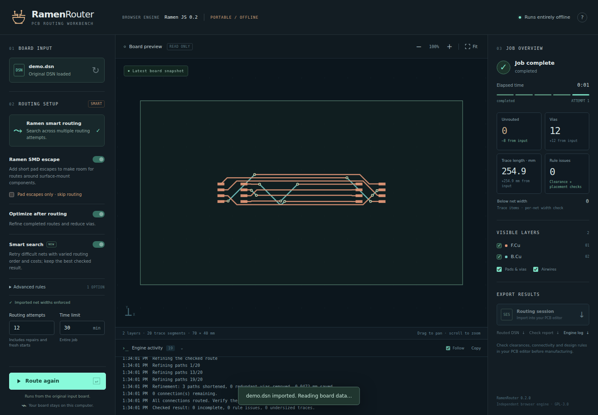

# RamenRouter 0.2.0

For hobbyists trying to cramp components onto small boards

An offline PCB autorouter that runs directly in your desktop browser.

## Start

1. Download this repository as a ZIP and extract it.
2. Double-click **RamenRouter.html**. Keep the adjacent files together.
3. Try the built-in demo, or open a Specctra **`.dsn`** exported by your PCB editor.
4. Route the board and download an **`.ses` routing session**, routed **`.dsn`**, JSON check report, or log.

No Java, installer, local server, account, or internet connection is required.
The browser processes your board locally. Closing the page discards results
that you have not downloaded.



## Routing

This edition has a new JavaScript engine with multilayer A* search, repeated
routing attempts, optional SMD fanout, and checked route optimization. New
traces retain their imported nominal widths. Fanout targets dense pad rows;
an escape-only option lets you inspect that stage independently.

The via-in-pad override is off by default. Enabling it explicitly changes the
imported via-placement permission.

This is **not an exact port of Freerouting 2.2.4 or its historical 2.1.0 fanout**.
Those releases informed the design investigation; their algorithms and results
are not reproduced exactly.

## Scope and validation

Inputs must contain placement, nets, outlines, and routing rules. Supported
features include signal layers, common pad shapes, class widths/clearances,
fixed copper, cutouts, and keepouts. Unsupported constraints are rejected;
the engine does not implement every Specctra feature or push-and-shove routing.
Some boards will remain partly unrouted.

Import the SES into the originating PCB editor, refill zones, and run its full
design-rule checks. CAD-side SES import and native Windows desktop operation
have not been tested here. Direct `file://` operation has been tested in Chrome
on Linux with external networking disabled.

See [VALIDATION.txt](VALIDATION.txt) for supported formats, measured generic
checks, and limits, and [README.txt](README.txt) for detailed operation.

## Development

The shipped HTML, CSS, and JavaScript are the editable source. Application use
requires no build. Node.js is only needed for developer tests:

```sh
node tests/dsn.test.js
node tests/geometry.test.cjs
node tests/fanout.test.cjs
node tests/router.test.cjs
node tests/optimizer.test.cjs
```

The optional browser suite also needs Playwright:

```sh
npm install --no-save playwright
npx playwright install chromium
node tests/browser-file.cjs
```

To use an installed Chromium-based browser, set `CHROME_PATH` to its executable
or pass `--browser "/path/to/chrome"`. Otherwise the suite uses Playwright's
installed Chromium. It tests only the included synthetic fixtures.

## License

GNU GPL version 3 or later. See [LICENSE](LICENSE) and
[THIRD-PARTY-NOTICES.txt](THIRD-PARTY-NOTICES.txt).
RamenRouter is an independent project, not an official Freerouting release.
