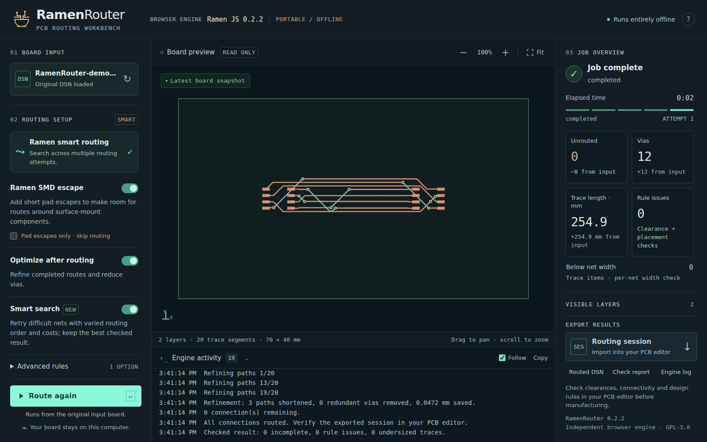

# Preface

I built this for a very specific reason: How small can I make a PCB, how much can I cram onto it, and how cheaply can I get it made?
Extra layers cost money. Finer traces cost money. Smaller holes cost money.
I didn’t want to solve a difficult layout by making the board more expensive to manufacture. I wanted the routing algorithm to work harder instead.
That calls for some algorithmic gymnastics.

The goal isn’t the prettiest traces. It’s squeezing more onto a smaller, cheaper board—and finding a way to make it all connect.
So, if you care more about making it fit than making it pretty, meet Ramen Router.
100% vibe-coded. Ready to eat.

Runs in your browser. 100% online, 100% client-side processing.

Nothing to install. Just load your DSN, let it cook, and export your SES.

[Open RamenRouter](https://effishen.github.io/RamenRouter/)

## Get started

1. [Open RamenRouter](https://effishen.github.io/RamenRouter/) in your desktop browser.
2. Try the included demo, or import a **.dsn** board exported from your PCB editor.
3. Click **Start routing** and follow the progress.
4. Download the **.ses routing session** when the job finishes.
5. Import that session into the PCB editor you used to export the board.

## Use it offline

Download the [current RamenRouter folder](https://github.com/Effishen/RamenRouter/archive/refs/heads/main.zip),
extract the whole folder, and double-click **index.html**. Keep all the supplied files
together in that folder. No internet connection is needed for the downloaded app.

## Working with your board

Place your components and set your board's routing rules in your PCB editor
before exporting the .dsn file.

Use the board preview to zoom, pan and show or hide layers. The job overview
shows progress and any connections still waiting to be routed. You can stop a
job, adjust the settings and try again.

With **Smart search** enabled, RamenRouter makes a final focused attempt when
only a few connections remain. It keeps the best checked result throughout.

**Stop job** stops routing and keeps the best checked attempt. Choose **View
best result** to see the remaining connections and placement advice, or **Keep
stopped** to leave the job stopped. Viewing a result does not restart routing.

Gentle highlights point to the next useful action: loading a board, starting a
run, reviewing advice or downloading a completed routing session.

If connections remain and vias in surface-mount pads could help, RamenRouter
offers **Enable and reroute**. This changes a board rule, so use it only if
your board can be manufactured with vias in those pads. You can also choose
**Keep current rules** and keep your existing result.

Alongside the .ses session, you can download a routed .dsn, a check report and
the job log.

If a board has overlapping pads or routing gets stuck, **Placement advice**
can point out areas to inspect. Choose **Show area** to find them on the board.
Make any placement changes in your PCB editor, export a new .dsn and try again.
Suggestions are starting points, not a promise that moving a part will finish
the board. When an export omits component names, advice uses pad and net labels.

## Keep and review your results

Download anything you want to keep **before starting another run, closing the
page or reloading it**. Results are not saved automatically.

After importing the session into your PCB editor, review the routes, refill
copper zones if your board uses them, and run the editor's design-rule checks.
Some connections may still need to be finished by hand. Check the completed
board before sending it for manufacture.

[License](LICENSE)
